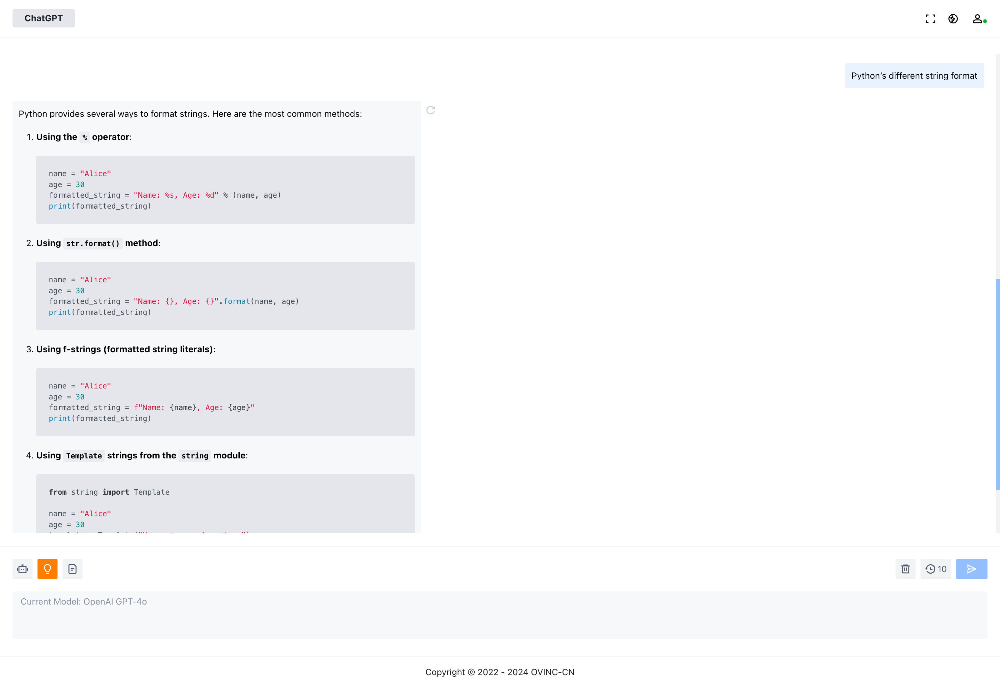

# ChatGPT Web

ChatGPT Web is a powerful multi-model access platform that supports various mainstream AI models and provides WeChat payment integration. The project adopts a front-end and back-end separation architecture, with the front end built using Vue for static deployment and the back end using Django for horizontal scaling.

## Features

- **Multi-Model Access**: Supports various AI models including Azure OpenAI, Tencent Hunyuan, Alibaba Tongyi Qianwen, Baidu ERNIE-BOT, Google Gemini, Moonshot V1, and more.
- **WeChat Payment Integration**: Provides WeChat payment integration for convenient user transactions.
- **Front-End and Back-End Separation**: The front end is built using Vue for static deployment, and the back end is built using Django for horizontal scaling, supporting high concurrency access.

## Technology Stack

- **Front End**: Vue ([View Front-End Code](https://github.com/OVINC-CN/ChatGPTWeb))
- **Back End**: Django

## Deployment

### Prepare Environment Variables

```
WEB_PROCESSES=1
WEB_THREADS=10
WORKER_COUNT=1
DEBUG=False
LOG_LEVEL=INFO
APP_CODE=chatgpt-api
APP_SECRET=<Unmodifiable after generation>
BACKEND_HOST=api.example.com
FRONTEND_URL=https://example.com
DB_NAME=chatgpt_api
DB_USER=chatgpt_api
DB_PASSWORD=<DB Password>
DB_HOST=<DB Host>
DB_PORT=3306
REDIS_HOST=<Redis Host>
REDIS_PORT=6379
REDIS_PASSWORD=<Redis Password>
REDIS_DB=<Redis DB>
SESSION_COOKIE_DOMAIN=.example.com
OVINC_API_DOMAIN=<Contact us to obtain>
OPENAI_HTTP_PROXY_URL=http://proxy.example.com:3814
QCLOUD_SECRET_ID=<Tencent Cloud SecretID>
QCLOUD_SECRET_KEY=<Tencent Cloud SecretKey>
QCLOUD_COS_URL=https://cos.example.com
QCLOUD_COS_BUCKET=example-cos-12345678
GEMINI_API_KEY=<Gemini API Key>
OPENAI_MAX_ALLOWED_TOKENS=<Max Token Count for Conversations>
QIANFAN_ACCESS_KEY=<Baidu Qianfan Access Key>
QIANFAN_SECRET_KEY=<Baidu Qianfan Secret Key>
DASHSCOPE_API_KEY=<Alibaba Dashscope API Key>
DJANGO_SETTINGS_MODULE=entry.settings
KIMI_API_KEY=<Moonshot API Key>
KIMI_API_BASE_URL=https://api.moonshot.cn/v1
WXPAY_ENABLED=0
WXPAY_PRIVATE_KEY_SERIAL_NO=<WeChat Pay Certificate Serial Number>
WXPAY_PRIVATE_KEY_PATH=<WeChat Pay Private Key Path>
WXPAY_APP_ID=<WeChat Pay App ID>
WXPAY_MCHID=<WeChat Pay Merchant ID>
WXPAY_API_V3_KEY=<WeChat Pay V3 API Key>
WXPAY_NOTIFY_URL=<WeChat Pay Callback URL>
WXPAY_UNIT=<WeChat Pay Settlement Unit>
```

### Deployment

```bash
docker run -d --name ChatGPTAPI \
--env-file <env file> \
ccr.ccs.tencentyun.com/ovinc/chatgpt-api:<release_version> \
/bin/sh -c "gunicorn --bind \"[::]:8020\" -w $WEB_PROCESSES --threads $WEB_THREADS -k uvicorn_worker.UvicornWorker --proxy-protocol --proxy-allow-from \"*\" --forwarded-allow-ips \"*\" entry.asgi:application"
```

## License

This project is distributed under the MIT License. For more details, please refer to the [LICENSE](./LICENSE).
