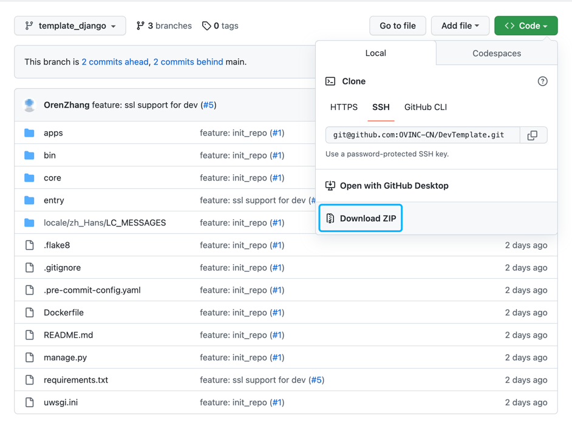

## Django Template

Django Template for OVINC Services

## Quick Start

### 1. Download Code



### 2. Install Dependecies

```bash
$ pip install -r requirements.txt
```

### 3. Prepare Environment

Create `.env` file in the base directory

```env
UWSGI_PROCESSES=
UWSGI_THREADS=
DEBUG=
LOG_LEVEL=
APP_CODE=
APP_SECRET=
BACKEND_HOST=
FRONTEND_URL=
DB_NAME=
DB_USER=
DB_PASSWORD=
DB_HOST=
DB_PORT=
REDIS_HOST=
REDIS_PORT=
REDIS_PASSWORD=
REDIS_DB=
SESSION_COOKIE_DOMAIN=
OVINC_API_DOMAIN=
```

### 4. Start Service

```bash
$ python manage.py runsslserver dev.api.com:8000
```

### 5. Customization

Now you can customize your app.

## Publish

```bash
$ docker build . -t ${label}:${tag}
$ docker push ${repo}/${label}:${tag}
```
