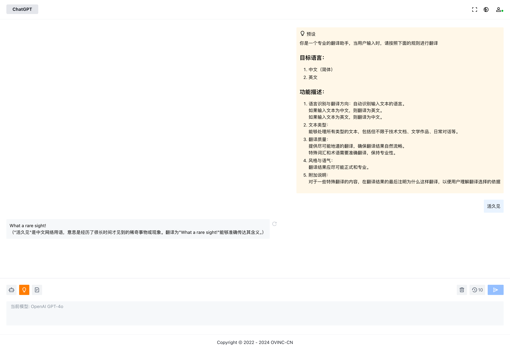

# ChatGPT Web

ChatGPT Web 是一个强大的多模型接入平台，支持多种主流的AI模型，并提供了微信支付接入能力。该项目采用前后端分离的架构，前端由Vue构建，可静态部署，后端使用Django搭建，可横向扩容。

## 功能特点

- **多模型接入**：支持Azure OpenAI、腾讯混元、阿里通义千问、百度ERNIE-BOT、字节跳动豆包、Google Gemini、Moonshot V1等多种AI模型。
- **微信支付接入**：提供了微信支付的接入能力，方便用户进行支付操作。
- **前后端分离**：前端由Vue构建，可静态部署，后端使用Django搭建，可横向扩容，支持高并发访问。

## 技术栈

- **前端**：Vue ([查看前端代码](https://github.com/OVINC-CN/ChatGPTWeb))
- **后端**：Django 

## 部署

### 准备环境变量

```
WEB_PROCESSES=1
WEB_THREADS=10
WORKER_COUNT=1
DEBUG=False
LOG_LEVEL=INFO
APP_CODE=chatgpt-api
APP_SECRET=<生成后不可修改>
BACKEND_HOST=api.example.com
FRONTEND_URL=https://example.com
DB_NAME=chatgpt_api
DB_USER=chatgpt_api
DB_PASSWORD=<DB密码>
DB_HOST=<DB Host>
DB_PORT=3306
REDIS_HOST=<Redis Host>
REDIS_PORT=6379
REDIS_PASSWORD=<Redis 密码>
REDIS_DB=<Redis DB>
SESSION_COOKIE_DOMAIN=.example.com
OVINC_API_DOMAIN=<请联系我们获取>
QCLOUD_SECRET_ID=<腾讯云 SecretID>
QCLOUD_SECRET_KEY=<腾讯云 SecretKey>
QCLOUD_COS_URL=https://cos.example.com
QCLOUD_COS_BUCKET=example-cos-12345678
OPENAI_MAX_ALLOWED_TOKENS=<对话最大 Token 数>
DJANGO_SETTINGS_MODULE=entry.settings
WXPAY_ENABLED=0"
WXPAY_PRIVATE_KEY_SERIAL_NO=<微信支付证书序列号>
WXPAY_PRIVATE_KEY_PATH=<微信支付密钥路径>
WXPAY_APP_ID=<微信支付公众号 App ID>
WXPAY_MCHID=<微信支付商户 ID>
WXPAY_API_V3_KEY=<微信支付 V3 API Key>
WXPAY_NOTIFY_URL=<微信支付回调地址>
WXPAY_UNIT=<微信支付结算单位>
```

### 部署

```bash
docker run -d --name ChatGPTAPI \
--env-file <env file> \
ccr.ccs.tencentyun.com/ovinc/chatgpt-api:<release_version> \
/bin/sh -c "gunicorn --bind \"[::]:8020\" -w $WEB_PROCESSES --threads $WEB_THREADS -k uvicorn_worker.UvicornWorker --proxy-protocol --proxy-allow-from \"*\" --forwarded-allow-ips \"*\" entry.asgi:application"
```

## 许可证

本项目基于MIT许可证进行分发，详细信息请参见[LICENSE](./LICENSE)。
